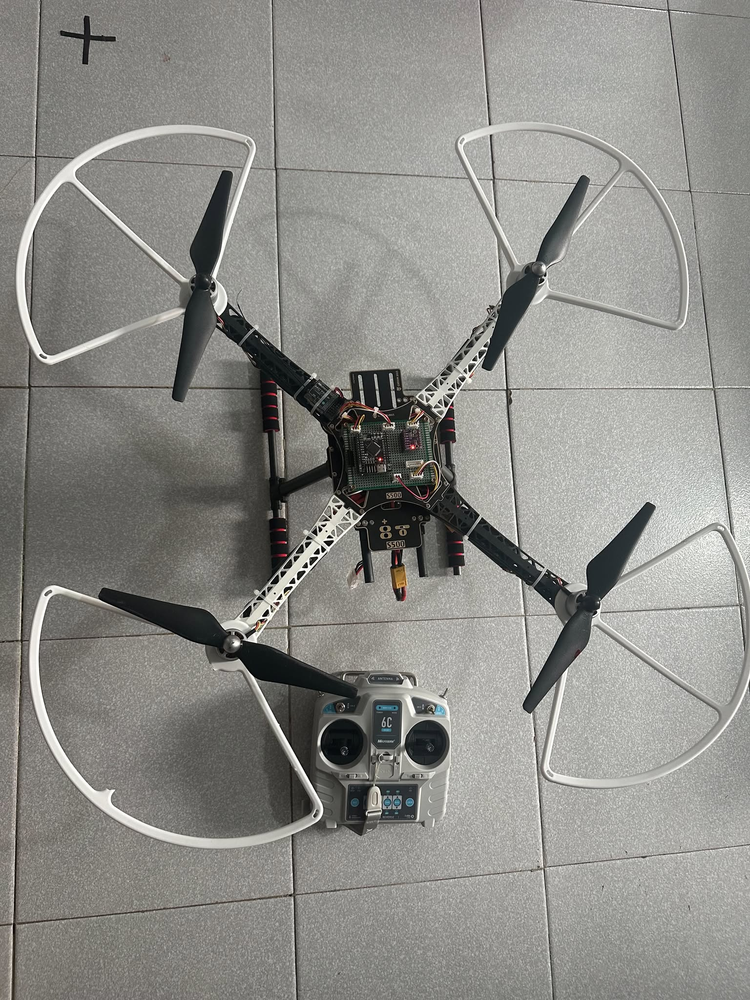

# Đồ án chuyên ngành Cơ điện tử: Thiết kế chế tạo quadcopter và xây dựng thuật toán giữ độ cao, vị trí cho quadcopter trong môi trường khép kín

Kho lưu trữ (Repository) này chứa các tài liệu, mã nguồn và dữ liệu tính toán thuộc nhánh `hardware_drone_stm32f405rgt6`.

## 🎯 Nhiệm vụ đảm nhiệm

### 1. Tính toán tải trọng và lực nâng
Trước khi tiến hành lựa chọn linh kiện, hệ thống cần được tính toán kỹ lưỡng để đảm bảo khả năng bay ổn định:
- **Tối ưu tải trọng:** Xác định tổng trọng lượng dự kiến của hệ thống (khung S500, pin 5300mAh, vi điều khiển, cảm biến...).
- **Phân tích lực nâng:** Đánh giá và tính toán lực đẩy (Thrust) thực tế tạo ra từ cấu hình tổ hợp: Động cơ Phantom 3 850KV + Cánh quạt 9450 + Nguồn điện 14.8V (Pin 4S). 
- **Mục tiêu:** Đạt được tỷ lệ lực đẩy/trọng lượng (Thrust-to-Weight Ratio) tối ưu, nhằm đảm bảo drone cất cánh an toàn, bay ổn định và xác định được giới hạn tải trọng dư thừa nếu gắn thêm thiết bị (như camera, gimbal).

### 2. Lựa chọn linh kiện và Tích hợp phần cứng
Dựa trên các thông số tính toán lực nâng và tải trọng ở trên, hệ thống phần cứng được chốt cấu hình và tiến hành mua sắm, lắp ráp. Dưới đây là bảng chi tiết các module được sử dụng:

| Phân loại | Tên linh kiện | Chức năng chính | Hình ảnh minh họa |
| :--- | :--- | :--- | :---: |
| **Bộ điều khiển trung tâm** | **Kit WeAct STM32F405RGT6** | Vi điều khiển trung tâm (Flight Controller), xử lý thuật toán bay. |  |
| **Cảm biến & Định vị** | **IMU BMI323** | Đo lường quán tính (gia tốc và góc quay). |  |
| | **Optical Flow MTF-01P** | Cảm biến quang học hỗ trợ giữ vị trí tầm thấp. |  |
| | **GPS GEP-M10-DI** | Module La bàn |  |
| **Hệ thống Động lực** | **Khung (Frame) S500** | Khung giá đỡ chịu lực cho toàn bộ hệ thống drone. | |
| | **Động cơ Phantom 3 850KV** | Động cơ không chổi than (Brushless Motor) tạo lực quay. | |
| | **Cánh quạt 9450** | Tạo lực nâng đẩy hệ thống khi kết hợp với động cơ. | |
| **Năng lượng & Giao tiếp** | **Pin LiPo Ovonic 4S 5300mAh** | Cấp nguồn năng lượng (14.8V) cho toàn bộ cấu hình. | |
| | **Bộ Tay điều khiển (Tx/Rx)** | Giao tiếp sóng RF để điều khiển drone từ xa. | |

### 3. Hình ảnh thực tế của Drone sau khi lắp ráp

  

