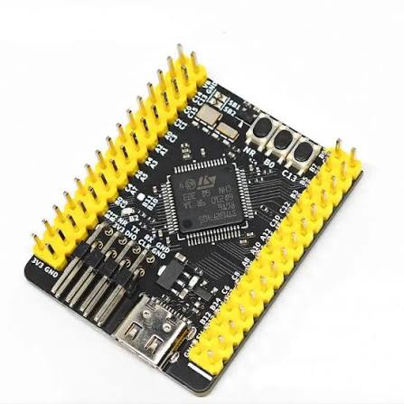
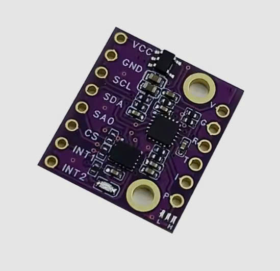
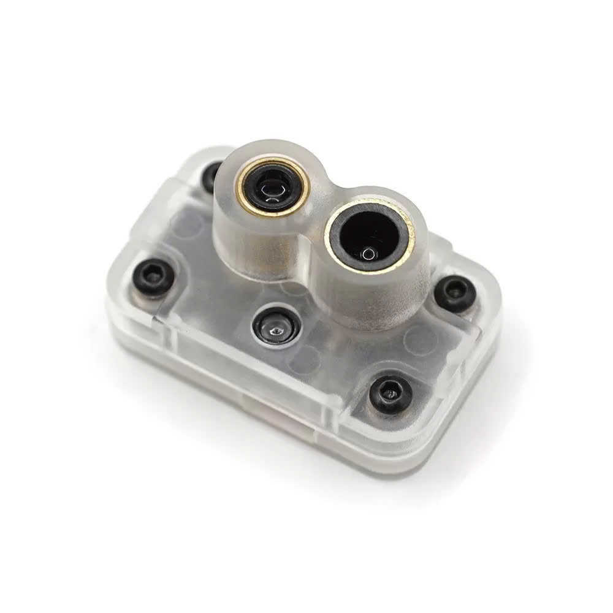
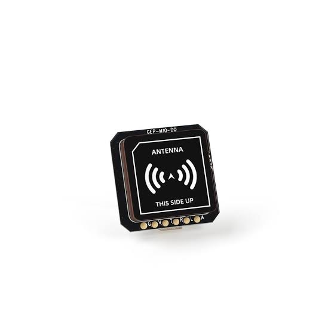

# Đồ án chuyên ngành Cơ điện tử: Thiết kế chế tạo quadcopter và xây dựng thuật toán giữ độ cao, vị trí cho quadcopter trong môi trường khép kín

Kho lưu trữ (Repository) này chứa các tài liệu, mã nguồn và dữ liệu tính toán thuộc nhánh `hardware_drone_stm32f405rgt6`.

## 🎯 Nhiệm vụ đảm nhiệm
### 1. Tích hợp phần cứng
Đảm nhiệm việc nghiên cứu lựa chọn, mua sắm và lắp ráp các module phần cứng rời rạc thành một hệ thống drone hoàn chỉnh. Cấu hình chi tiết bao gồm:

**Bộ điều khiển bay trung tâm (Flight Controller):** Dựa trên Kit phát triển WeAct STM32F405RGT6.

  

**Hệ thống Cảm biến & Định vị:**
- Cảm biến IMU BMI323 để đo lường quán tính (gia tốc và góc quay).
  

    
  

- Cảm biến quang học Optical Flow MTF-01P hỗ trợ giữ vị trí tầm thấp.
  

    
  

- Module GPS GEP-M10-DI để định vị tọa độ.
  

    
  

**Hệ thống Động lực (Propulsion):** Sử dụng khung Frame S500, kết hợp với động cơ không chổi than Phantom 3 850KV và cánh quạt 9450.

**Năng lượng & Điều khiển:** Cấp nguồn bởi pin LiPo Ovonic 4S 110C 5300mAh và điều khiển từ xa thông qua tay điều khiển cùng bộ thu phát (Rx/Tx) sóng RF.

### 2. Tính toán tải trọng và lực nâng
**Phân tích lực nâng:** Đánh giá và tính toán lực đẩy (Thrust) thực tế tạo ra từ cấu hình tổ hợp: Động cơ Phantom 3 850KV + Cánh quạt 9450 + Nguồn điện 14.8V (Pin 4S).

**Tối ưu tải trọng:** Xác định tổng trọng lượng hệ thống (khung S500, pin 5300mAh, vi điều khiển, cảm biến...). Từ đó tính toán tỷ lệ lực đẩy/trọng lượng (Thrust-to-Weight Ratio) nhằm đảm bảo drone cất cánh an toàn, bay ổn định và xác định được giới hạn tải trọng dư thừa nếu gắn thêm thiết bị khác.

## 🛸 Hình ảnh thực tế của Drone

  

